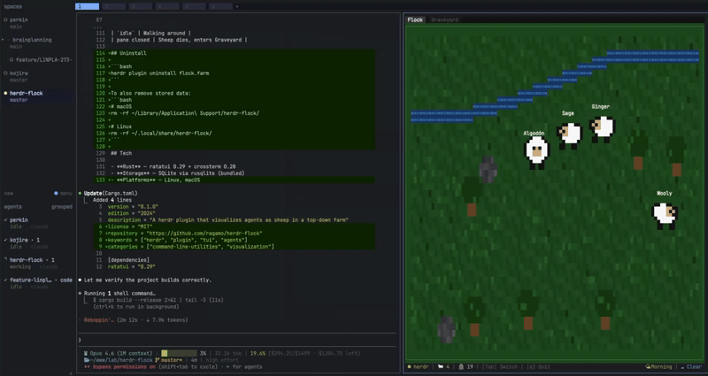

# herdr-flock

A [herdr](https://herdr.dev) plugin that visualizes your AI coding agents as pixel-art sheep living on a top-down farm.

Each agent gets its own sheep. While it works, the sheep grazes and glows. When the session ends, the sheep dies and is remembered in the Graveyard. The farm features procedurally generated terrain with rivers, trees, and rocks, unique each session. A day/night cycle shifts the palette from bright greens to moonlit blues, and weather rolls in with rain or snow that drifts across the landscape.



## Requirements

- [Rust](https://www.rust-lang.org/tools/install) 1.85+ (edition 2024)
- [herdr](https://herdr.dev) 0.7.0+
- A terminal with Unicode and 256-color support

## Installation

### From the herdr marketplace

```bash
herdr plugin install ragamo/herdr-flock
```

The build step runs automatically during install. Make sure `cargo` is available in your PATH.

### From source

```bash
git clone https://github.com/ragamo/herdr-flock.git
cd herdr-flock
cargo build --release
herdr plugin link .
```

### Keybinding

Add to your herdr config (`~/.config/herdr/config.toml`) to open the farm with `prefix+i`:

```toml
[[keys.command]]
key = "prefix+i"
type = "plugin_action"
command = "flock.farm.open"
description = "Open Flock Farm"
```

This opens the farm as a split pane to the right of your focused pane in the current workspace.

## Usage

### As a herdr plugin

Once installed, open the farm from any workspace:

```bash
# Via keybinding (requires config above)
prefix+i

# Via CLI
herdr plugin pane open --plugin flock.farm --entrypoint farm --placement split --direction right --focus
```

The plugin auto-discovers the herdr socket and shows live agent state. If no socket is found, it falls back to demo mode with mock sheep.

### Standalone (demo mode)
```bash
cargo run
```
Launches with mock sheep so you can explore without herdr running.

## Keyboard & Mouse

| Key / Action | Effect |
|---|---|
| `Tab` | Switch between Flock and Graveyard |
| `q` | Quit |
| `↑↓` | Scroll in Graveyard |
| `f` | Cycle filter (All / Alive / Dead) in Graveyard |
| Click on sheep | Show tooltip with name, project, agent |
| Drag sheep | Pick up and move sheep around the farm |
| Click on tab | Switch screen |
| Click on row (Graveyard) | Show epitaph panel for dead sheep |

## Data

Sheep history is stored at:
- **macOS**: `~/Library/Application Support/herdr-flock/flock.db`
- **Linux**: `~/.local/share/herdr-flock/flock.db`

## Agent → Sheep mapping

| herdr state | Sheep behavior |
|---|---|
| `working` | Pulses yellow, wanders |
| `blocked` | Eating animation |
| `done` | Sleeping |
| `idle` | Walking around |
| pane closed | Sheep dies, enters Graveyard |

## Uninstall

```bash
herdr plugin uninstall flock.farm
```

To also remove stored data:
```bash
# macOS
rm -rf ~/Library/Application\ Support/herdr-flock/

# Linux
rm -rf ~/.local/share/herdr-flock/
```

## Tech

- **Rust** — ratatui 0.29 + crossterm 0.28
- **Storage** — SQLite via rusqlite (bundled)
- **Platforms** — Linux, macOS
